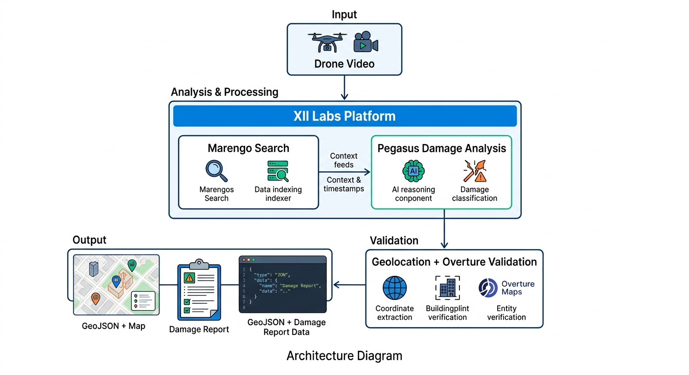

# Disaster Zone Aerial Assessment System

## Problem
Automated detection of disaster damage, blocked roads, and resource delivery routes from aerial video.

## Solution
Uses:
- TwelveLabs Marengo 3.0
- TwelveLabs Pegasus 1.2
- Overture Maps Foundation

Outputs:
- Damage assessment
- Obstruction detection
- Resource distribution routes
- Financial damage estimate
- GeoJSON map outputs
# About the Project

## Inspiration

We were inspired by the impacts of a tornado that hit the St. Louis area last year. The city is still feeling the effects of the disaster, and something needed to be done to speed up response time, distribution of aid, and allocation of resources. In the immediate aftermath of a disaster, every hour counts , but the traditional process of assessing damage requires boots on the ground, manual surveys, and days of data collection before responders can even begin to prioritize where help is needed most. We wanted to change that. With drone technology becoming increasingly common in emergency response, we saw an opportunity to pair aerial footage with modern AI to turn raw video into actionable intelligence in minutes, not days.

---

## What it does

The Disaster Zone Aerial Assessment System takes aerial drone footage of a disaster-affected area and automatically generates a full situational intelligence report, **no manual video review required**.

In a single pipeline run, the system produces:

- **Damage inventory** — identifies every damaged structure visible in the footage, classified by damage type (roof loss, structural collapse, flooding, downed power lines, etc.), severity, structure type, and real-world location
- **Resource manifest** — maps each damage finding to specific emergency supplies and services (tarps, chainsaw crews, generators, water pumps, structural engineers), with quantities, delivery locations, and priority tiers (immediate, short-term, long-term)
- **Access & route analysis** — flags every road and corridor as passable, partially blocked, or fully blocked, with obstruction details and alternate route suggestions; also identifies viable helicopter landing zones and staging areas
- **Financial damage estimate** — counts damage instances and applies FEMA and insurance industry unit cost ranges to produce low, mid, and high cost estimates across 11 damage categories
- **Interactive map** — geocodes every damage location and blocked route and plots them on a live map, color-coded by damage type
- **Validation report** — scores the quality of the AI's own output using parse success rates, field completeness, cross-section consistency checks (e.g., does every blocked route have a corroborating damage entry?), and a 3-iteration repeatability test that measures how consistent the model is across independent runs

All of this is surfaced through a clean Streamlit web application where users upload footage, select a disaster type and region, and click Run — then explore the results across six interactive tabs with downloadable markdown and JSON reports.

---

## How we built it

The core intelligence layer is built on **TwelveLabs**, using two models operating on the same indexed video:

- **Marengo 3.0** — semantic video embedding and scene search. We run six targeted queries (blocked road debris, flooded road, collapsed bridge, downed power lines, fire, open landing zone) to surface exact video timestamps where each condition appears.
- **Pegasus 1.2** — video-language generation. We run five carefully engineered prompts that extract structured JSON from the model: location identification, damage assessment, resource requirements, access analysis, and financial damage counting.

The application stack is:

- **Streamlit** for the web interface — sidebar configuration, tabbed results, and download buttons
- **pydeck + CARTO tiles** for the interactive damage map — no Mapbox token required
- **OpenStreetMap Nominatim** for geocoding location descriptions to lat/lon coordinates, with multi-strategy fallback (simplified query → city center offset) so all damage items appear on the map even when locations are vague
- **Python + pandas** for data processing and the validation/repeatability engine
- **yt-dlp** as a companion utility for downloading drone footage from YouTube when a direct file isn't available

We also built a full **Jupyter notebook** interface for iterative development and inspection alongside the production web app, keeping both in sync throughout the project.

---

## Challenges we ran into

We experienced challenges with the model's output consistency with short, limited-context videos. When footage covers only a small geographic area or a short duration, Pegasus has less visual evidence to draw from, which can lead to underreporting of damage or lower confidence estimates. Otherwise it performs very well with longer, comprehensive drone surveys.

On the technical side, we worked through several integration challenges:

- **TwelveLabs SDK migration** — the SDK had significant API changes between versions (renamed resources, changed parameter keys, different model option formats), which required careful inspection and adaptation of every API call
- **JSON parsing robustness** — Pegasus occasionally returns uppercase field names, wraps responses in markdown code blocks, or returns staging areas as structured objects instead of strings; we built normalization and fallback logic throughout
- **Geocoding accuracy** — location descriptions generated by Pegasus are sometimes too vague for a geocoder to resolve precisely. We implemented a multi-strategy fallback that tries progressively simpler queries and ultimately plots approximate locations near the city center so no damage event is silently dropped from the map
- **Financial prompt design** — early iterations of the financial counting prompt used literal zeros as placeholder values in the template JSON, which caused Pegasus to return the template unchanged. Switching to descriptive placeholders (`<count of buildings with total roof missing>`) resolved this entirely

---

## Accomplishments that we're proud of

The system is very user friendly and provides a ton of value for businesses and entities who need to quickly analyze disaster data and respond effectively. It can really speed up response time for first responders and emergency managers.

Beyond usability, we're proud of the depth of the output. What started as a damage classifier grew into a full situational intelligence platform with a financial estimation engine, a self-validating consistency framework, and a live geocoded map — all from a single video upload. The validation suite in particular stands out: rather than simply trusting the AI's output, the system cross-references all five analysis sections against each other and flags gaps (e.g., a blocked road with no corresponding damage entry, or a financial category with no matching damage type), giving users a concrete measure of how much to trust any given run. The repeatability tester adds another layer by quantifying how consistent the model is across independent calls on the same video, expressed as a coefficient of variation per damage category.

We're also proud that the system runs entirely without proprietary mapping APIs — the geocoded map uses open CARTO tiles and OpenStreetMap's Nominatim geocoder, making it accessible without additional service accounts.

---

## What we learned

We learned that the TwelveLabs models are highly effective at understanding context — even in complex, rapidly changing aerial footage — a powerful capability that can produce value for many different domains.

We also learned that **prompt engineering for structured output is its own discipline**. Getting Pegasus to consistently return clean, parseable JSON across five different analysis tasks required iterative refinement: the specificity of field descriptions, the format of example values, and even the phrasing of the instruction to "only output JSON" all meaningfully affect output quality and parseability. The improvement we saw from switching financial prompt placeholders from `0` to `<count of buildings with total roof missing>` illustrated just how literally these models interpret template structure.

Working with a multimodal video model also reinforced the value of **corroborating signals**. Marengo and Pegasus approach the same video from different angles — semantic embedding vs. natural language generation — and cross-referencing their outputs (e.g., does Marengo find a "collapsed bridge" scene that Pegasus also flagged in the damage assessment?) is a meaningful quality signal that neither model could provide alone.

---

## What's next for Resource Distribution

The immediate next step is extending the system from assessment to active resource coordination — closing the loop between identifying what's needed and dispatching it.

- **Real-time multi-feed ingestion** — process simultaneous drone feeds from multiple operators covering different sectors of a disaster zone, merging results into a unified command dashboard
- **Integration with emergency dispatch systems** — push resource manifests directly to logistics platforms (FEMA logistics, municipal emergency management systems, NGO supply chains) rather than requiring manual handoff from the report
- **Longitudinal tracking** — re-run assessment on the same area across multiple days to track recovery progress, flag areas that have deteriorated, and reallocate resources dynamically as conditions change
- **Ground-truth feedback loop** — allow first responders in the field to confirm or correct AI assessments via a mobile interface, feeding corrections back to improve prompt quality over time
- **Expanded geography and disaster types** — calibrate the location-context prompting and unit cost tables for additional cities and disaster types (wildfire perimeter mapping, hurricane storm surge, earthquake liquefaction zones)
- **Confidence-weighted routing** — incorporate the validation and repeatability scores into resource prioritization logic, so areas with high-confidence assessments receive resources first while lower-confidence areas are flagged for human review

## Architecture

## Demo
(put demo video link here)

## License
Apache 2.0
